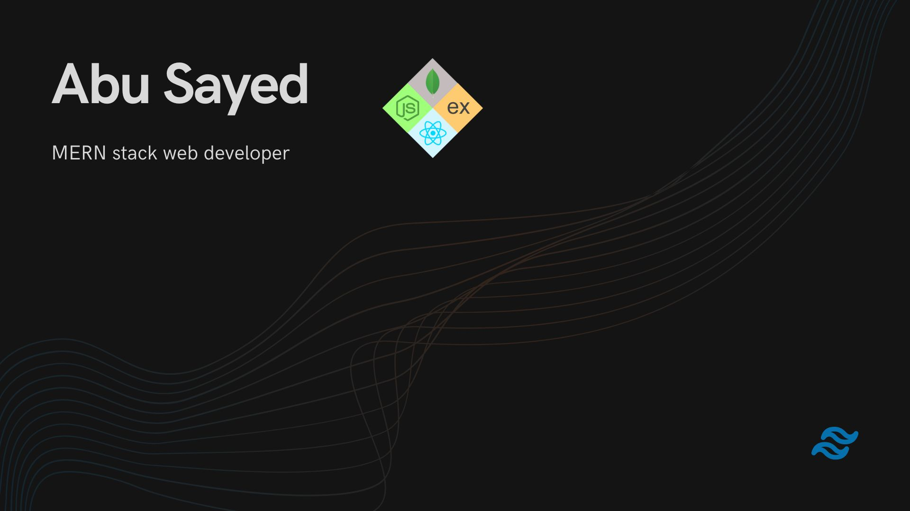
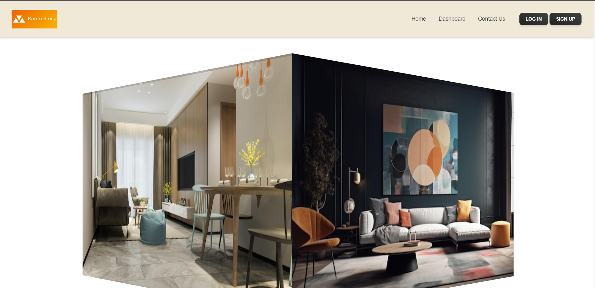

<!-- banner  -->

<!-- social account  -->
## 🔍 Find me

 
 
 

<!-- technology icon -->
## 💻 Technologies that i know
 

 
 
 
 
 
 
 

 

 
 
 
 

 

 
 

 
<!-- tool icon  -->
## 🔨 Tools that i use
 

 
 
 
 

 

<!-- current stats  -->
## 📈 Current stats

<!-- language stats -->
## ⌨️ Most used languange

<!-- per day hour commit  stats  -->
## 🕗 Per day hour commit stats

## 🚀 Latest projects
### 🌟 [Room Story](https://room-story.netlify.app/)

**Room Story** is a company employee management website. Three different role based user can use the website which are Employee, Hr and Admin.
#### Common features 
* Role based difffent dashboard.
* Sucured client route and server api.(only can be accessed by specific role based user)
* Fully mobile, tablet and desktop responsive user interface.
#### Hr features
* Hr can toggle employee verify status.
* Can pay an verified employee (onces for a month).
* Can see any employee monthly payment graph in a bar chart.
* Can see all employee submitted task. Task can be filtered by employee name and date.
#### Employee features 
* Employee can see his/her payment history.
* Can submit his/her task.
#### Admin features
* Admin can see all verified employee(including Hr).
* Can fire any employee(including Hr), fired employee cann't log in again with this account.
* Can make an employee Hr.

    admin email: admin@gmail.com

    password: 111111
#### Project links 
* [live-website](https://room-story.netlify.app/)
* [client-side code repo](https://github.com/abusayed0/room-story-client-batch8)
* [server-side code repo](https://github.com/abusayed0/room-story-server-batch8)

<!--
**abusayed0/abusayed0** is a ✨ _special_ ✨ repository because its `README.md` (this file) appears on your GitHub profile.

Here are some ideas to get you started:

- 🔭 I’m currently working on ...
- 🌱 I’m currently learning ...
- 👯 I’m looking to collaborate on ...
- 🤔 I’m looking for help with ...
- 💬 Ask me about ...
- 📫 How to reach me: ...
- 😄 Pronouns: ...
- ⚡ Fun fact: ...
-->
